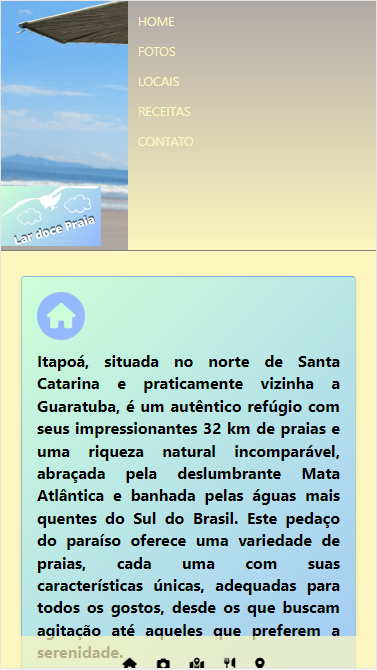
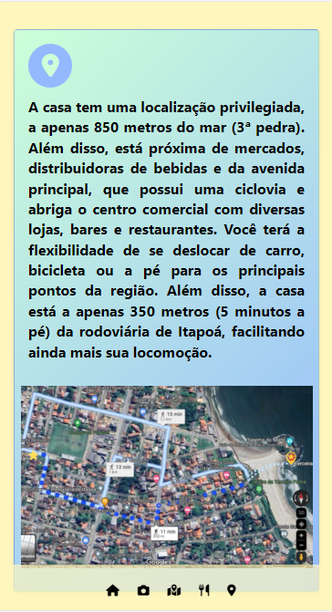
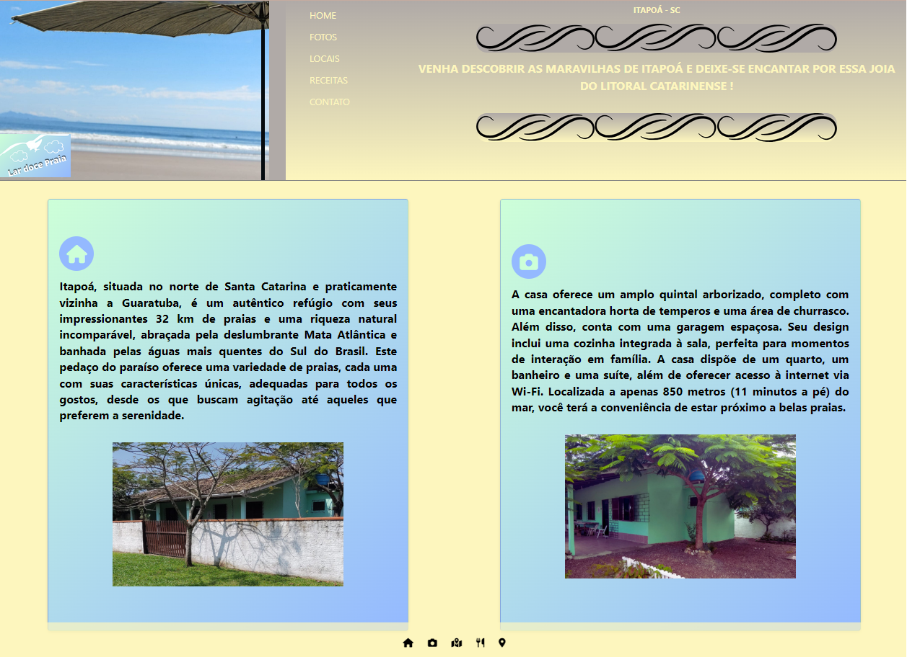

# larDocePraia
Site destinado para uma casa de praia no litoral de Santa Catarina / Website dedicated to a beach house on the coast of Santa Catarina, Brazil.

[Visite o site / Visit the website](http://lardocepraia.lovestoblog.com/)

# Sobre o Projeto / About the Project
Este projeto tem como objetivo a criação de um site dedicado à apresentação de uma encantadora casa localizada na deslumbrante praia do litoral de Santa Catarina. O site foi meticulosamente projetado para proporcionar uma experiência de navegação perfeita em dispositivos móveis, oferecendo a sensação de um aplicativo intuitivo. Com um design responsivo, o site é acessível para todos os públicos.

This project aims to create a website dedicated to showcasing a charming house located on the stunning coast of Santa Catarina, Brazil. The website has been meticulously designed to provide a seamless browsing experience on mobile devices, offering the feel of an intuitive app. With a responsive design, the site is accessible to all audiences.

# Tecnologias Utilizadas / Technologies Used

Este projeto é construído com a utilização das seguintes tecnologias: / This project is built using the following technologies:

  - HTML e CSS: Utilizando recursos especiais para garantir uma experiência única. / HTML and CSS: Utilizing special features to ensure a unique experience.
  - Bootstrap: Aproveitando o poder do Bootstrap para criar um design responsivo e atrativo. / Bootstrap: Harnessing the power of Bootstrap to create a responsive and appealing design.

# Mobile Layout

   

# Web Layout

# Autor / Author
Bruno Cesar Serafim
[Linkedin](https://www.linkedin.com/in/bcserafim) - [Site Pessoal](http://bcserafim.infinityfreeapp.com/)
